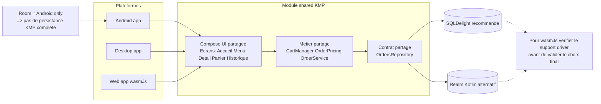

## TD3 : Application Kotlin Multiplateforme (KMP)

### Objectif
Faire évoluer PizzApp (TD2) en application multiplateforme pour :
- Android
- Navigateur Web (Wasm)
- Desktop (Windows / macOS / Linux)

### Auteur
- Étudiant : Riad El Moudden
- Travail réalisé en individuel (pas de binôme)

### État d'avancement TD3
- [x] Module shared KMP créé
- [x] Cible Android branchée sur le code partagé
- [x] Cible Desktop opérationnelle
- [x] Cible Web (Wasm) opérationnelle
- [x] UI graphique sur Android / Desktop / Web (objectif: 100% Compose Multiplatform partagée)
- [x] Données/Repository partagés
- [x] Persistance adaptée hors-Android (fichier JSON Desktop + localStorage Web)
- [~] Migration persistance KMP en cours
	- [x] SQLDelight branché sur Android
	- [x] SQLDelight branché sur Desktop
	- [x] Web (Wasm) conserve fallback `localStorage` validé

### Architecture finale
- UI partagée: écrans Compose Multiplatform uniques (Accueil, Menu, Détail, Panier, Historique) consommés par Android, Desktop et Web.
- Les modules plateformes ne gardent que le bootstrap (entry point), le wiring DI et les APIs spécifiques plateforme.
- La logique métier est partagée dans `shared` (`OrderService`, panier, calcul du total, historique).
- Le contrat de persistance est partagé via `OrdersRepository`.
- La persistance SQLDelight est isolée dans le module `persistence` (Android/Desktop) pour éviter les conflits de dépendances avec la cible `wasmJs`.
- Cible de persistance unifiée:
  - Option recommandée: `SQLDelight` (schéma SQL + drivers multiplateformes)
  - Option alternative: `Realm Kotlin` (si compatibilité plateforme confirmée)
  - Contrainte importante: pour `wasmJs`, vérifier le driver/dispositif de stockage disponible avant validation finale.

- État actuel implémenté:
	- Android: `SqlDelightOrdersRepository` via module `persistence` (base SQLite `pizzapp.db`)
	- Desktop: `SqlDelightOrdersRepository` via module `persistence` (base SQLite locale `~/.pizzapp/pizzapp.db`)
	- Web: `WebLocalStorageOrdersRepository` (fallback temporaire en attendant une stratégie SQL Wasm validée)

### Graphique d'architecture (partage UI + métier + persistance)

### Validation TD3
- Le projet correspond à l'objectif "même application multi-plateforme" au niveau fonctionnalités et parcours utilisateur.
- L'UI et la logique métier sont partagées entre Android/Desktop/Web via Compose Multiplatform + `shared`.
- La persistance est déjà unifiée via SQLDelight sur Android/Desktop; le point restant est l'alignement Web (`wasmJs`).
- La persistance est unifiée via SQLDelight sur Android/Desktop, et stabilisée sur Web via fallback `localStorage` compatible `wasmJs`.

### Repo TD3 - Version 2
- Cette version (TD3 v2) inclut l'utilisation de `SQLDelight` et une interface graphique 100% partagée avec Compose Multiplatform.
- Lien du repository: `git@github.com:ElMouddenRiad/td3_KMP.git`

### Difficultés rencontrées et solutions

- Difficulté 1 : `Room` n'est pas directement multi-plateforme (Android-centric).
	- Solution actuelle : création d'une interface commune `OrdersRepository` dans `shared`, avec implémentations dédiées par plateforme.
	- Décision d'architecture cible : remplacer `Room` par une solution KMP.
	- Pourquoi : `Room` est Android-only, donc ne permet pas une persistance réellement partagée.
	- Choix pragmatique :
	  - `SQLDelight` est en général le meilleur candidat KMP pour une base partagée.
	  - `Realm Kotlin` est possible selon les cibles supportées, mais à valider pour le web `wasmJs`.

- Difficulté 2 : éviter la duplication de logique panier/total entre plateformes.
	- Solution : extraction du domaine dans `shared` (`Pizza`, `CartManager`, `OrderPricing`, `OrderService`) et réutilisation depuis Android, Desktop et Web.

- Difficulté 3 : cible web KMP (choix techno + compatibilité).
	- Solution : choix de `wasmJs` (approche moderne Compose/Kotlin), adaptation du code pour éviter les API JVM-only et configuration d'une page d'entrée web compatible Compose.

- Difficulté 4 : verrouillage Yarn/Kotlin Wasm lors du run web.
	- Solution : exécution de la tâche `:kotlinWasmUpgradeYarnLock` pour synchroniser le lockfile et relancer le serveur web.

- Difficulté 5 : historique non persistant sur Desktop/Web après redémarrage.
	- Solution initiale : implémentation de repositories persistants :
	  - `DesktopFileOrdersRepository` (fichier JSON local)
	  - `WebLocalStorageOrdersRepository` (localStorage navigateur)
	- Évolution TD3 : migration vers `SqlDelightOrdersRepository` pour Android/Desktop (persistances SQL partagées).
	- Décision technique: conserver `localStorage` comme fallback officiel pour Web tant qu'une solution SQLDelight `wasmJs` n'est pas validée.

### Démo vidéo
- Lien vidéo (YouTube) : (https://youtu.be/rbQUNSVh0lg)
- La vidéo montre :
	- le lancement Android
	- le lancement Desktop
	- le lancement Web

### Commandes utiles
- Android : exécution depuis Android Studio (`app`)
- Desktop : `./gradlew :desktopApp:run`
- Web (Wasm) : `./gradlew :webApp:wasmJsBrowserDevelopmentRun`

